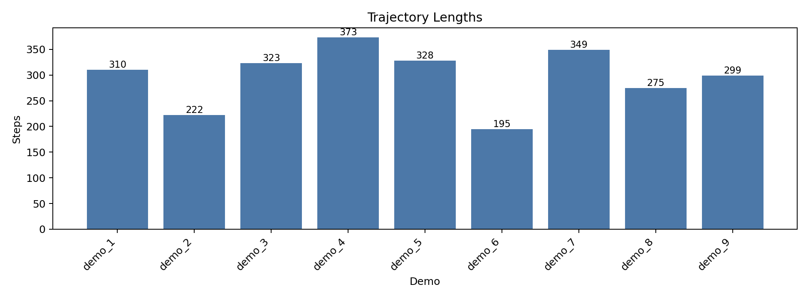
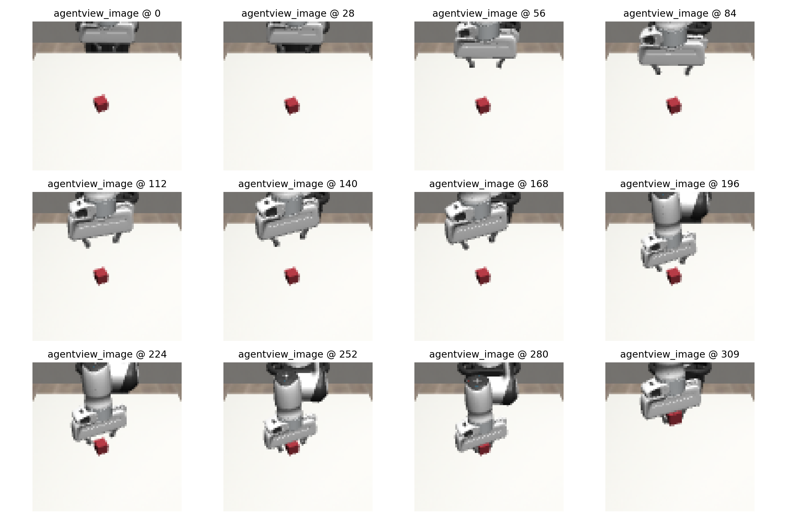
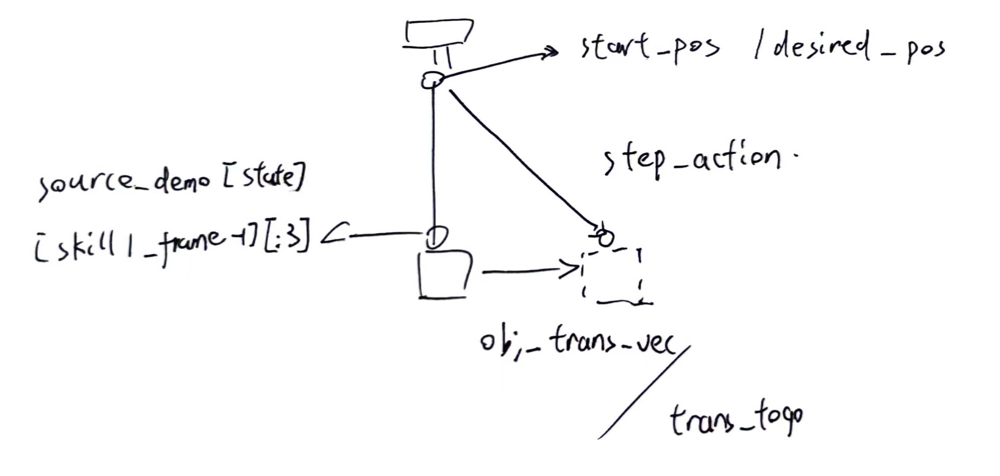
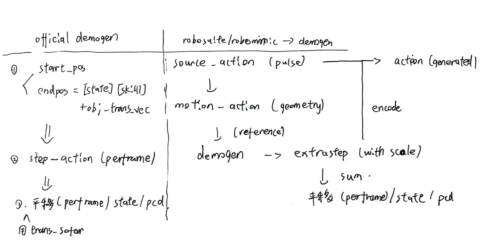

[TOC]

# Pipeline

- `robosuite`
  - 仿真与采集
  - 建环境、控制机器人、采集 demo、回放 demo、导出原始 `demo.hdf5`。
- `robomimic`
  - 数据集转换、训练与评测
- `DemoGen`：轨迹和观测数据的数据增广

- `robomimic`
  - 训练 policy、做 rollout 、评测。


---

## Setup

工作区搭建

```
/home/willzhang/Science/Reproduction/Reproduction
├── repos
│   ├── DemoGen
│   ├── robosuite
│   └── robomimic
├── data
│   ├── raw
│   ├── processed
│   └── generated
├── scripts    分析、验证、绘图、后处理等辅助脚本
│     
├── outputs    可视化与训练权重
│     
└── configs    本地训练配置，给 robomimic 使用
        
```

---

### 采 9 条 robosuite demo

```bash
conda activate robosuite
 # Mujoco键位
    # ↑ / ↓ 前后移末端
    # ← / → 左右移末端
    # .     向下
    # ;     向上
    # o / p yaw
    # y / h pitch
    # e / r roll
    # Space 开合夹爪，按一次切换一次

# 9 Episode
# 20 fps
python ~/Science/Reproduction/Reproduction/repos/robosuite/robosuite/scripts/collect_human_demonstrations.py \
  --environment Lift \
  --robots Panda \
  --device keyboard \
  --renderer mjviewer \
  --camera agentview \
  --directory /home/willzhang/Science/Reproduction/Reproduction/data/raw/lift_0
```


生成数据集：`/home/willzhang/Science/Reproduction/Reproduction/data/raw/lift_0/1774702988_8036063/demo.hdf5`
```
data/demo_1/action_dict/gripper             shape=(310, 1)   dtype=float32
data/demo_1/action_dict/rel_pos             shape=(310, 3)   dtype=float32
data/demo_1/action_dict/rel_rot_6d          shape=(310, 6)   dtype=float32
data/demo_1/action_dict/rel_rot_axis_angle  shape=(310, 3)   dtype=float32
data/demo_1/actions                         shape=(310, 7)   dtype=float64
data/demo_1/states                          shape=(310, 32)  dtype=float64
```

- 310：Demo的时间长度
- `actions` (7)：3 维末端位移 `dx, dy, dz` + 3 维末端旋转增量 + 1 维夹爪开合。
- `states` (32)：MuJoCo 展平状态， `time + qpos + qvel`，主要给仿真回放和状态恢复用，不是最适合直接拿来训练的观测。
- `gripper` (1)：夹爪开 / 合。
- `rel_pos` (3)：末端相对位移 `dx, dy, dz`。
- `rel_rot_axis_angle` (3)：末端相对旋转，用 axis-angle 表示。
- `rel_rot_6d` (6)：同一个旋转的 6D 表示。

**回放**

```bash
python robosuite/scripts/playback_demonstrations_from_hdf5.py \
  --folder  /home/willzhang/Science/Reproduction/Reproduction/data/raw/lift_0/1774702988_8036063
```
---
### 转成 robomimic 数据集
`demo.hdf5` 是 `robosuite` 的原始轨迹格式， `robomimic` 中用带有 `obs / next_obs `的内容的格式训练
- `low_dim.hdf5`：位置、姿态、夹爪、物体状态等。
- `image.hdf5`：相机图像。

#### **convert**
* 读取 demo.hdf5 里的环境元信息和轨迹
* 按 robomimic 的约定补齐 / 整理 metadata
* 给数据集加上 mask/train、mask/valid 
  
```bash
conda activate robomimic

python repos/robomimic/robomimic/scripts/conversion/convert_robosuite.py \
  --dataset /home/willzhang/Science/Reproduction/Reproduction/data/raw/lift_0/1774702988_8036063/demo.hdf5
```
#### **low-dim**

```bash
cd /home/willzhang/Science/Reproduction/Reproduction/repos/robomimic/robomimic/scripts

python repos/robomimic/robomimic/scripts/dataset_states_to_obs.py \
  --dataset /home/willzhang/Science/Reproduction/Reproduction/data/raw/lift_0/1774702988_8036063/demo.hdf5 \
  --output_name low_dim.hdf5 \
  --done_mode 2
```
`/home/willzhang/Science/Reproduction/Reproduction/data/raw/lift_0/1774702988_8036063/low_dim.hdf5`

- `object` (10)：方块位置(3) + 方块四元数(4) + gripper 到方块的相对位置(3)
- `robot0_eef_pos` (3)：机械臂末端位置 [x, y, z]。
- `robot0_eef_quat` (4)：机械臂末端姿态四元数。
- `robot0_gripper_qpos` (2)：左右夹爪手指关节位置。
- `robot0_joint_pos` (7)：Panda 7 个关节角。
- `robot0_joint_vel` (7)：Panda 7 个关节速度。

#### **image**

```bash
python repos/robomimic/robomimic/scripts/dataset_states_to_obs.py \
  --dataset /home/willzhang/Science/Reproduction/Reproduction/data/raw/lift_0/1774702988_8036063/demo.hdf5  \
  --output_name image.hdf5 \
  --done_mode 2 \
  --camera_names agentview \
  --camera_height 84 \
  --camera_width 84 \
  --compress \
  --exclude-next-obs
```

`/home/willzhang/Science/Reproduction/Reproduction/data/raw/lift_0/1774702988_8036063/image.hdf5` ：

```text
obs/agentview_image            (310, 84, 84, 3)   uint8
obs/robot0_eye_in_hand_image   (310, 84, 84, 3)   uint8
obs/object                     (310, 10)
obs/robot0_eef_pos             (310, 3)
obs/robot0_eef_quat            (310, 4)
obs/robot0_gripper_qpos        (310, 2)
actions                        (310, 7)
rewards                        (310,)
dones                          (310,)
states                         (310, 32)
```

- `agentview_image` (84, 84, 3)：主相机[H, W, C]。
- `robot0_eye_in_hand_image` (84, 84, 3)：局部相机 [H, W, C]。

#### **depth**

```bash
python repos/robomimic/robomimic/scripts/dataset_states_to_obs.py \
  --dataset /home/willzhang/Science/Reproduction/Reproduction/data/raw/lift_0/1774702988_8036063/demo.hdf5 \
  --output_name depth.hdf5 \
  --done_mode 2 \
  --camera_names agentview \
  --camera_height 84 \
  --camera_width 84 \
  --depth
```
`/home/willzhang/Science/Reproduction/Reproduction/data/raw/lift_0/1774702988_8036063/depth.hdf5`

#### 对robomimic数据集做一个可视化
```bash
python repos/robomimic/robomimic/scripts/visualize_robot_dataset.py \
  --dataset /home/willzhang/Science/Reproduction/Reproduction/data/raw/lift_0/1774702988_8036063/image.hdf5 \
  --output-dir outputs/dataset_viz/your_run
```





---
## 数据增广

### 当前 pipeline

1. 采 source demo，得到 `demo.hdf5 / low_dim.hdf5 / depth.hdf5`
2. 用 一系列 convert 生成 `source zarr`
3. 生成`generated zarr`
4. 对 generated `zarr` 做 replay，检验是否正常
5. 跑 consistency validation / success rate
6. 前面都过了，进入训练 / eval

### 为什么要转 `zarr`
`demogen.py`输入： 
* `action`：`data/action`，单条 310 帧 demo 时 shape = `(310, 7)`
  7 = 3 维平移控制 `dx, dy, dz` + 3 维旋转控制 + 1 维夹爪控制
* `agent_pos`：`data/agent_pos`，单条 310 帧 demo 时 shape = `(310, 7)`
  7 = 3 维末端位置 `eef_pos` + 3 维姿态 `rotvec` + 1 维夹爪开口 `gripper_gap`
* `point_cloud`：`data/point_cloud`，单条 310 帧 demo 时 shape = `(310, 1024, 6)`
  每一帧采样 1024 个点`[x, y, z, r, g, b]`

将`hdf5`转换成 `source zarr`，要求：
* generate 出来 replay 轨迹正常 
* 点云视频正常


### 从`hdf5`到`zarr`

#### 问题

Lift 的 raw `action[:3]` 是来自 controller 的 pulse，demogen motion 段的增广需要逐帧的几何位移，如果像这样在pulse空间做增广，generate出来会变形。

#### 为什么要加 motion_action 修正？
DemoGen 在 motion 段思路是：
* 先生成一条新轨迹：根据 source 轨迹的起点、终点和新物体位置，构造 motion 段每一帧的 step_action 决定新 demo 动作
* 因为点云和state需要和轨迹同步，所以需要逐帧计算轨迹偏差： step_action - source_action[:3]，得到这一帧相对 source 的增量差
* 把这个差累积成 trans_sofar，用 trans_sofar 去平移 robot 的 state 和 point_cloud



但是`step_action` 是几何位移，`raw_action[:3]` 是控制脉冲，两个量不在同一语义空间。这会导致平移出来的state有误差

#### 怎么做？

* source action 首先被转换为一份近似几何运动参考 motion_action，这一步仍然带有近似误差；
* DemoGen 基于这份近似几何量，在 motion 段中计算相对 source 的额外平移增量，这样的语义比直接对 raw pulse 做减法求得平移量更稳定；
* 这部分几何增量再通过 pulse encoder 映射回 controller action，并叠加到原始 executable pulse 上；
* 最终写回 generated zarr 的 data/action 仍然是 pulse 语义的 executable action。




#### **motion_action 怎么来的？**

1.  通过 `convert_robomimic_hdf5_to_zarr_exec_xzfullfir4sum.py` 得到 base source zarr。得到一版几何接口。**这版误差体现在：如果直接用这个去做generate，出来的物体位置不算准，伸的深度不够**

如何构造一版几何的 `motion_action`：
  - x / z：用 full FIR 响应把 pulse 映射成几何效果
  - y：直接用 `forward_delta[:, 1]`
  - gripper：沿用 `action[:, 6]`


```bash
cd /home/willzhang/Science/Reproduction/Reproduction

conda run -n demogen python repos/DemoGen/real_world/convert_robomimic_hdf5_to_zarr_exec_xzfullfir4sum.py \
  --demo-hdf5 /home/willzhang/Science/Reproduction/Reproduction/data/raw/lift_0/1774702988_8036063/demo.hdf5 \
  --low-dim-hdf5 /home/willzhang/Science/Reproduction/Reproduction/data/raw/lift_0/1774702988_8036063/low_dim.hdf5 \
  --depth-hdf5 /home/willzhang/Science/Reproduction/Reproduction/data/raw/lift_0/1774702988_8036063/depth.hdf5 \
  --source-name lift_0_v9_execmotion_xzfullfir4sum \
  --output-zarr /home/willzhang/Science/Reproduction/Reproduction/repos/DemoGen/data/datasets/source/lift_0_v9_execmotion_xzfullfir4sum.zarr
```

2. 用 `convert_source_zarr_original_schedule_motion.py` 处理 source zarr，读取`state`/ `action`/ `motion_action`/`skill1_frame`，然后重写 motion 段的 `motion_action[:3]`，调用 `build_original_one_stage_schedule(...)`，应用和demogen相同的原则，假设平移量是0，会生成什么样的轨迹？这个轨迹之后在demogen中直接做减法求得平移量：
  - 取 source 轨迹在 motion 段的起点 `state[0, :3]`
  - 取终点 `state[skill1_frame - 1, :3]`
  - 把 z 方向拆成固定步长，再把剩余帧平均分给 xy，翻转后得到先走 xy 下探 z的schedule

写回motion_action：

- `new_motion[start : start + ep_skill1, :3] = schedule_xyz`上面生成的schedule
- `new_motion[start : start + ep_skill1, 6] = action[start : start + ep_skill1, 6]`，夹爪沿用相同维度的动作


```bash
cd /home/willzhang/Science/Reproduction/Reproduction

conda run -n demogen python repos/DemoGen/real_world/convert_source_zarr_original_schedule_motion.py \
  --input-zarr /home/willzhang/Science/Reproduction/Reproduction/repos/DemoGen/data/datasets/source/lift_0_v9_execmotion_xzfullfir4sum.zarr \
  --output-zarr /home/willzhang/Science/Reproduction/Reproduction/repos/DemoGen/data/datasets/source/lift_0_v21_originalschedule_motion_v9_s220.zarr \
  --source-name lift_0_v21_originalschedule_motion_v9_s220 \
  --skill1-frame 190 \
  --z-step-size 0.015 \
  --copy-sam-mask
```

#### **motion_action 在 generate 里怎么被用？**
`demogen_lift_phase_copy.py`：外挂一个模块，override了demogen.py的one_stage_augment，读取和保存还用demogen完成，只是在这里进行增广

输入：
- `state`/`pcd`
- `source_exec_action`：controller action，来自 `data/action`
- `source_motion_action`：给 DemoGen 参考的几何 motion，来自 `data/motion_action`。

每一帧：
- 先按 schedule 把总平移拆成每帧的 translation_increments （这次 retarget 的增广平移量）， `extra_step = translation_increments[j]`。
- 再构造这一帧理论上想实现的几何 motion：
  - `step_action = source_motion_action[:3] + extra_step`
- 然后回到 `demogen.py`中增加的`source_plus_correction`：
  - `correction_step = step_action - source_motion_action[:3]`。表示：新目标下这一帧理论 motion，减去 source 原本这一帧的参考 motion，还差多少
  - `correction_xyz = _encode_motion_exec_xyz(correction_step, ...)`。差值再经过 pulse 编码，变成加回 controller 的 correction
  - `exec_xyz = source_exec_action[:3] + correction_xyz`，映射回 pulse 空间

#### Notice
1. motion_action本身存在误差，需要`translation_correction_scale_xyz = [0.5, 0.5, 1.0]`用来修正extrastep
- xy correction 只加0.5，z加1倍。用来抑制接近物体和下探阶段易出现的横向过修正。当前pipeline里 xy 更容易因为 pulse 量化和 schedule 近似被放大，所以只修一半，但是针对不同任务可能需要调整，故此为一优化方向

2. state_based 和原版 legacy 的区别 
- `legacy` 把 source 的 motion 起点近似写成 `state[start] - action[start]`，默认认为 `action[:3]` 本身就接近逐帧 motion；同时它按 `trans_this_frame = step_action - source_motion_action[:3]` 去逐帧累积 `trans_sofar`；
- `state_based` 把 `state[start][:3]` 当作 motion 起点；后续维护 `desired_pos += step_action`，再用 `trans_sofar = desired_pos - source_pos`， 比 `legacy` 更少依赖 `action[:3]` 本身的几何语义
- 这更适合 pulse ：因为 controller pulse 不是逐帧几何位移，用 `state` 比用 `action` 反推轨迹更稳

3. 配置文件在：`lift_v28_originalschedule_phasecopy_statedelta_halfcorr_v9_s220.yaml` 

### 做增广
```bash 
cd /home/willzhang/Science/Reproduction/Reproduction/repos/DemoGen/demo_generation

bash gen_demo.sh lift_0_v28_originalschedule_phasecopy_statedelta_halfcorr_v9_s220 test grid 4 False

```

其中：
- `bash gen_demo.sh lift_v28_originalschedule_phasecopy_statedelta_halfcorr_v9_s220 ...`
- `gen_demo.sh` 调用 `gen_demo.py`读取 yaml，并根据其中的 `_target_` 实例化 generator，指向 `demogen_lift_phase_copy.py`
- 每条增广16条
### 增广数据可视化验证

```bash
conda run -n demogen python /home/willzhang/Science/Reproduction/Reproduction/scripts/replay_zarr_episode.py \
  --zarr /home/willzhang/Science/Reproduction/Reproduction/repos/DemoGen/data/datasets/generated/lift_0_v28_originalschedule_phasecopy_statedelta_halfcorr_v9_s220_test_16.zarr \
  --source-demo /home/willzhang/Science/Reproduction/Reproduction/data/raw/lift_0/1774702988_8036063/demo.hdf5 \
  --episode 0 \
  --control-steps 1 \
  --output-video /home/willzhang/Science/Reproduction/Reproduction/videos/replay_lift_0_v28_test16_ep0.mp4
```

### 增广数据 Gate

```bash
conda run -n demogen python /home/willzhang/Science/Reproduction/Reproduction/scripts/validate_generated_zarr_consistency.py \
  --zarr /home/willzhang/Science/Reproduction/Reproduction/repos/DemoGen/data/datasets/generated/lift_0_v28_originalschedule_phasecopy_statedelta_halfcorr_v9_s220_test_16.zarr \
  --source-demo /home/willzhang/Science/Reproduction/Reproduction/data/raw/lift_0/1774702988_8036063/demo.hdf5 \
  --control-steps 1 \
  --rmse-threshold 0.015 \
  --final-threshold 0.015 \
  --output-json /home/willzhang/Science/Reproduction/Reproduction/outputs/analysis/lift_0_v28_test16_consistency.json
```
结果：144条全部Lift成功，说明该pipeline有效

### 失误 
思维惯性用demogen里面的dp3去训练，但是由于前述原因“最终写回 generated zarr 的 data/action 仍然是 pulse 语义的 action”。导致学到的仍是 pulse-like action distribution，这样的动作标签里有很多接近 0 的帧，夹杂少量离散脉冲，再加上 encode / threshold / residual 的量化效应，训练会更难、更不稳定。

通过fork许多版本的dp3训练Pipeline达到了近似的效果，能够取得非常不稳定的成功，如：

/home/willzhang/Science/Reproduction/Reproduction/repos/DemoGen/data/ckpts/lift_v28_originalschedule_phasecopy_statedelta_halfcorr_v9_s220_test_9-dp3phasebias-seed0-pb_a/checkpoints/79.ckpt

```bash
cd /home/willzhang/Science/Reproduction/Reproduction/repos/DemoGen/diffusion_policies

SOURCE_DATASET=/home/willzhang/Science/Reproduction/Reproduction/data/raw/lift_keyboard_1/1774355871_95818/demo.hdf5 \
EVAL_EPISODES=3 \
SAVE_VIDEO=True \
bash eval_panda_phasebias.sh \
  lift_v28_originalschedule_phasecopy_statedelta_halfcorr_v9_s220_test_9 \
  0 \
  79 \
  1 \
  pb_a
```

补充说明：

- `79.ckpt` 对应 `phasebias v1`，run 名是 `pb_a` / `dp3phasebias`。它改 sampler：把 pre-grasp descent 和 gripper switch 附近的 window 重复采样，让 raw-action DP3 更频繁看到“下探 + 闭合”片段。


### 三层误差
* source_motion_action 本身就只是近似几何 proxy，不是真实物理真值。
* extra_step 也是按 schedule 分配出来的增广位移。
* 最后把 correction 再 encode 回 pulse，这里又会有 threshold / residual / 饱和误差。
---

## 在 robomimic 上训练 DP
路线纠正过后，直接把 `lift_0` 的 generated zarr 导回 robomimic，再用 diffusion policy 训练。

###  导出 `lift_0` 训练集

用
- generated zarr（共153条数据）：`lift_0_v28_originalschedule_phasecopy_statedelta_halfcorr_v9_s220_test_16.zarr`
- source low-dim：`data/raw/lift_0/1774702988_8036063/low_dim.hdf5`
- 输出：`data/processed/robomimic/lift_0_v28_demogen_lowdim.hdf5`

```bash
cd /home/willzhang/Science/Reproduction/Reproduction

conda run -n demogen python repos/DemoGen/real_world/export_demogen_zarr_to_robomimic_lowdim.py \
  --generated-zarr /home/willzhang/Science/Reproduction/Reproduction/repos/DemoGen/data/datasets/generated/lift_0_v28_originalschedule_phasecopy_statedelta_halfcorr_v9_s220_test_16.zarr \
  --source-low-dim-hdf5 /home/willzhang/Science/Reproduction/Reproduction/data/raw/lift_0/1774702988_8036063/low_dim.hdf5 \
  --output-hdf5 /home/willzhang/Science/Reproduction/Reproduction/data/processed/robomimic/lift_0_v28_demogen_lowdim.hdf5 \
  --include-source-demos \
  --overwrite
```

### 启动训练

```bash
ROOT=/home/willzhang/Science/Reproduction/Reproduction
RUN_NAME=lift_0_v28_demogen_dp_$(date +%Y%m%d_%H%M%S)_1

conda run -n robomimic python $ROOT/repos/robomimic/robomimic/scripts/train.py \
  --config $ROOT/configs/robomimic/diffusion_policy_lift_demogen_lowdim.json \
  --dataset $ROOT/data/processed/robomimic/lift_0_v28_demogen_lowdim.hdf5 \
  --name "$RUN_NAME" \
  > /tmp/${RUN_NAME}.stdout 2>&1 &

sleep 3

# 这里补充了训练进度可视化

RUN_ROOT=$(find "$ROOT/outputs/robomimic/diffusion_policy_demogen" -maxdepth 1 -type d -name "$RUN_NAME" | sort | tail -n 1)
RUN_DIR=$(find "$RUN_ROOT" -mindepth 1 -maxdepth 1 -type d | sort | tail -n 1)

tail -f "$RUN_DIR/logs/log.txt"
```

tensorboard：
```bash
conda run -n robomimic tensorboard \
  --logdir "$RUN_DIR/logs" \
  --bind_all --port 6006
```

配置文件 `diffusion_policy_lift_demogen_lowdim.json`:
- `train.num_epochs = 1200`
- `save.every_n_epochs = 150`
- `rollout.rate = 70`
- `rollout.n = 10`
- `rollout.horizon = 800`
- `always_save_latest = false`
- `checkpoint_state_mode = policy_only`


### Eval checkpoint

只看成功率：

```bash
conda run -n robomimic python /home/willzhang/Science/Reproduction/Reproduction/repos/robomimic/robomimic/scripts/run_trained_agent.py \
  --agent /home/willzhang/Science/Reproduction/Reproduction/outputs/robomimic/diffusion_policy_demogen/lift_0_v28_demogen_dp_20260328_230323_1/20260328230325/models/model_epoch_150.pth \
  --n_rollouts 50 \
  --horizon 800 \
  --seed 1
```

- `eval_epoch150_rollout100` 成功率 `0.73`
- `eval_epoch200_rollout100` 成功率 `0.56`
- `eval_epoch300_rollout100` 成功率 `0.48`

结论：153条数据在batch_size=80的配置下，在 150-200 epoch间达到eval最佳成功率。
